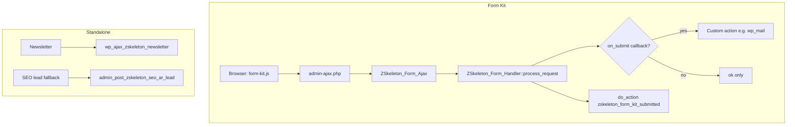

# ZSkeleton theme — forms and post-submit events

This document describes how **public and admin forms** in the `zskeleton` theme are wired: transport (AJAX vs full page POST), security checks, and what happens **after** a successful submit (email, storage, integrations).

**Scope:** `wp-content/themes/zskeleton/`. Membership registration/checkout lives in the **ZSkeleton Membership** plugin and is only referenced where the theme delegates to it (e.g. lead form shortcodes).

---

## Form systems at a glance

The theme uses **three patterns**, not one global “form events” engine:

| System | Typical use | Transport | Post-submit logic |
|--------|-------------|-----------|-------------------|
| **Form Kit** | Contact page, contact block, admin demos | AJAX → `admin-ajax.php` | Per-form `on_submit` callback + shared hooks |
| **Standalone handlers** | Footer newsletter, SEO lead fallback | AJAX or `admin-post.php` | Dedicated PHP functions |
| **WordPress core** | Comments | Normal POST to current URL | Core comment flow + theme `preprocess_comment` |



---

## 1. Form Kit (primary reusable API)

**Bootstrap:** `includes/extensions/form-kit/form-kit.php` (loaded from `functions.php`).

**Render:** `zskeleton_render_form( $form_id )` or `ZSkeleton_Form_Renderer::render()`.

**Register a form:** add to the `zskeleton_form_kit_forms` filter (see `includes/contact-form-kit.php` and `includes/extensions/form-kit/class-form-kit-demo.php`).

### Submission pipeline

1. **Client** (`assets/js/form-kit.js`): `fetch` to `admin-ajax.php` with `action=zskeleton_form_submit`, `zs_form_id`, `zs_form_nonce`, field values. Wizards may call `zskeleton_form_validate_step` between steps.
2. **Server** (`includes/extensions/form-kit/class-form-ajax.php`):
   - Resolve form via `ZSkeleton_Form_Definition::get()`
   - Verify nonce (`nonce_action` from form config)
   - **Authorize:** public forms if `allow_public_submission`; otherwise logged-in + `capability`
   - **Rate limit:** `zskeleton_form_kit_rate_limit_allow` filter (default allow)
   - **Bot protection** (public only): `ZSkeleton_ReCAPTCHA::verify_form_submission()` when enabled in theme settings
3. **Handler** (`includes/extensions/form-kit/class-form-handler.php`):
   - Honeypot check (if configured)
   - Allowlist field names from schema
   - Sanitize + validate per field type (`ZSkeleton_Field_Registry`)
   - On full submit (not step-only): call **`on_submit`** callback if set
4. **Response:** JSON success/error; optional `zskeleton_form_kit_submit_response_message` filter for user-facing text.

### Security features (Form Kit)

| Feature | Config key | Notes |
|---------|------------|--------|
| Nonce | `nonce_action` | Defaults to `zskeleton_form_{id}` |
| Honeypot | `honeypot` => field name | Hidden field; bots that fill it are rejected |
| reCAPTCHA / Turnstile | automatic on public forms | Theme **Security** settings; action `form_kit_{form_id}` |
| Capability | `capability` | Admin forms; default `manage_options` |
| Public flag | `allow_public_submission` | Required for `nopriv` AJAX |
| Rate limit | filter only | Implement via `zskeleton_form_kit_rate_limit_allow` |

### Form definition keys (common)

```php
$forms['my_form'] = array(
    'context'                 => 'public', // or 'admin'
    'allow_public_submission' => true,
    'use_ajax'                => true,
    'nonce_action'            => 'my_form_nonce',
    'honeypot'                => 'company_website',
    'capability'              => '', // empty for public
    'fallback'                => 'long_page', // no-JS: show all wizard steps
    'fields'                  => array( /* ... */ ),
    'steps'                   => array( /* optional wizard */ ),
    'on_submit'               => 'my_callback', // or array( $obj, 'method' )
);
```

**`on_submit` signature:** `( array $sanitized, ZSkeleton_Form_Definition $def ): true|WP_Error`

Return `true` on success, `WP_Error` or `false` on failure.

### Built-in field types

Registered in `includes/extensions/form-kit/class-form-field-types.php`:

**Phase 1:** `text`, `search`, `password`, `hidden`, `email`, `url`, `tel`, `textarea`, `number`, `range`, `select`, `checkbox`, `checkboxes`, `radio`, `toggle`, `date`, `time`, `datetime-local`, `color`, `file`

**Phase 2:** `media`, `image`, `wysiwyg`, `code`, `json`, `group`, `repeater`

Custom types: `zskeleton_form_kit_field_types` filter on `ZSkeleton_Field_Registry`.

---

## 2. Registered Form Kit forms (today)

| Form ID | Registered in | Context | Post-submit event |
|---------|---------------|---------|-------------------|
| `zskeleton_contact` | `includes/contact-form-kit.php` | Public | **Send email** (admin + auto-reply to user) via `wp_mail` |
| `zskeleton_demo_simple` | `class-form-kit-demo.php` | Admin only | **Save to transient** `zskeleton_form_kit_demo_last` (demo UI) |
| `zskeleton_demo_wizard` | `class-form-kit-demo.php` | Admin only | **Save to transient** (same) |

### `zskeleton_contact` — email events

Handler: `zskeleton_contact_form_kit_process_submit()`

1. **Admin notification** → `wp_mail( $contact_email, … )`  
   - Recipient: `zskeleton_contact_email` option, else `admin_email`
   - Includes name, email, org, phone, topic, priority, message, newsletter opt-in flag, timestamp, IP
2. **Auto-reply** → `wp_mail( $email, … )` to submitter  
   - Extra line if urgency is `urgent`

**Not implemented:** the contact form’s `newsletter_signup` toggle is only **mentioned in the admin email**; it does **not** call MailerLite or `zskeleton_newsletter_subscribers` today.

**UI:** Contact page / `zskeleton/contact-form` block → `zskeleton_render_form( 'zskeleton_contact' )`.

---

## 3. WordPress hooks and filters (Form Kit events)

Use these to extend behavior without forking the kit.

### Actions (fire on specific events)

| Hook | When | Arguments |
|------|------|-----------|
| `zskeleton_form_kit_submitted` | After successful submit (callback returned ok) | `$form_id`, `$sanitized` array |
| `zskeleton_form_kit_honeypot_triggered` | Honeypot field filled | `$form_id` |

**Example — log all Form Kit submissions:**

```php
add_action( 'zskeleton_form_kit_submitted', function ( $form_id, $data ) {
    error_log( 'Form submitted: ' . $form_id . ' ' . wp_json_encode( $data ) );
}, 10, 2 );
```

**Example — save to a custom table or CPT:**

```php
add_action( 'zskeleton_form_kit_submitted', function ( $form_id, $data ) {
    if ( 'zskeleton_contact' !== $form_id ) {
        return;
    }
    // insert_post, $wpdb->insert, CRM API, etc.
}, 10, 2 );
```

There is **no built-in “save to database”** action in Form Kit; use `on_submit` on the form definition or `zskeleton_form_kit_submitted`.

### Filters (configuration / gates)

| Filter | Purpose |
|--------|---------|
| `zskeleton_form_kit_forms` | Register / alter form schemas |
| `zskeleton_form_kit_field_types` | Register custom field types |
| `zskeleton_form_kit_rate_limit_allow` | Return `false` to block submit (throttle) |
| `zskeleton_form_kit_submit_response_message` | AJAX success message string |

### AJAX actions (WordPress)

| Action | Logged in | Guest | Purpose |
|--------|-----------|-------|---------|
| `zskeleton_form_submit` | yes | yes* | Full form submit |
| `zskeleton_form_validate_step` | yes | yes* | Wizard step validation only |

\*Guest only if `allow_public_submission` is true for that form.

---

## 4. Standalone theme forms (not Form Kit)

### Footer newsletter

| Item | Detail |
|------|--------|
| **Markup** | `footer.php` — `#newsletter-form` |
| **JS** | Inline in footer; `action=zskeleton_newsletter` |
| **Handler** | `zskeleton_newsletter_subscription()` in `functions.php` |
| **Security** | `zskeleton_nonce` (global AJAX nonce) |
| **On success** | 1. Optional **MailerLite** subscribe (`zskeleton_mailerlite_subscribe`, group `general`) when integration enabled<br>2. **Save email** to option `zskeleton_newsletter_subscribers` (array) |
| **Visibility** | `zskeleton_show_newsletter_section()` — MailerLite enabled + plugin configured |

### SEO / landing lead form (fallback)

| Item | Detail |
|------|--------|
| **Renderer** | `zskeleton_seo_ar_render_lead_form_column()` in `includes/seo-ar-lead-form.php` |
| **Priority** | Filter `zskeleton_landing_lead_form_html` → `zskeleton_seo_ar_lead_form_html` → theme mod shortcode → Gravity Forms → **fallback HTML form** |
| **Fallback transport** | POST `admin-post.php`, `action=zskeleton_seo_ar_lead` |
| **Security** | Nonce `zskeleton_seo_ar_lead`, honeypot `lead_honeypot`, reCAPTCHA/Turnstile when enabled |
| **On success** | **Send email** to `admin_email` via `wp_mail`; redirect with `?lead=sent` |
| **Used on** | `template-parts/home-seo-ar/`, SEO Expert landing (`zskeleton_seo_expert_render_lead_column`) |

### WordPress comments

| Item | Detail |
|------|--------|
| **Template** | `comments.php` → `comment_form()` |
| **Theme hooks** | `comment_form_defaults`, `comment_form_default_fields` |
| **Security** | Nonce `zskeleton_comment_submission`, honeypot `zskeleton_comment_hp`, captcha field `comment_submit` |
| **Validation** | `preprocess_comment` → `zskeleton_validate_comment_security()` |
| **On success** | **WordPress core** stores comment (moderation per site settings); no theme email layer |

---

## 5. Bot protection (shared)

Configured under **Appearance → ZSkeleton Settings → Security** (`includes/class-recaptcha.php`).

| Surface | Server verify | Client widget |
|---------|---------------|---------------|
| Form Kit (public) | `verify_form_submission()` in AJAX handler | Rendered in form; token via `form-kit.js` + `recaptcha.js` |
| SEO lead fallback | Same in `zskeleton_seo_ar_handle_lead_form()` | In fallback markup |
| Comments | `zskeleton_validate_comment_security()` | In comment form fields |

Provider: Google reCAPTCHA v3 or Cloudflare Turnstile (theme setting).

---

## 6. UI-built forms (admin builder)

**Since Form Kit 1.1.0**, forms can be created in **Theme Features → Forms** (`zskeleton_form` CPT). The admin UI is a **Vue 3** single-page app (Builder, Settings, After submit tabs).

| Piece | Path / detail |
|-------|----------------|
| CPT | `includes/post-types/class-forms.php` |
| Builder PHP | `includes/admin/class-form-builder-admin.php` — bootstrap JSON + save/preview AJAX |
| Builder source | `assets/src/form-builder/` (Vue 3 + Pinia + Vite + vuedraggable) |
| Built assets | `assets/js/form-builder-admin.js`, `assets/css/form-builder-admin.css` (generated; commit after changes) |
| Layout | `layout_tree` with `field`, `row`, and `column` nodes; per-row **Stack on mobile** |
| Shortcode | `[zskeleton_form id="post-slug"]` |
| Events | `ZSkeleton_Form_Events_Runner` — save submission, email admin/user, MailerLite |
| Submissions | Table `{prefix}zskeleton_form_submissions` + **Forms → Submissions** admin |
| Registry | `ZSkeleton_Form_Registry_Loader` merges published CPT forms into `zskeleton_form_kit_forms` |

### Building the form builder assets

From the theme directory:

```bash
cd wp-content/themes/zskeleton
npm install
npm run build:form-builder   # one-off build
npm run dev:form-builder     # watch mode (writes to assets/dist/form-builder; run build:form-builder to copy into assets/js)
```

`npm run build` at the theme root also runs `build:form-builder`. Initial state is passed via `<script type="application/json" id="zs-form-kit-bootstrap">` (Unicode-safe for Arabic labels). Save uses hidden JSON fields synced by Vue on post submit.

PHP-registered forms (`zskeleton_contact`, demos) are unchanged. Contact form migration to the builder is deferred.

### Still not covered

- Contact form newsletter toggle → MailerLite (still email text only on `zskeleton_contact`)
- Webhook action UI
- Visual conditional field logic in builder
- Contact form migration to CPT

Membership **register / login / payment** flows are handled by the plugin and are outside Form Kit.

---

## 7. Adding a new Form Kit form (code registration)

1. **Register** on `zskeleton_form_kit_forms`:

```php
add_filter( 'zskeleton_form_kit_forms', function ( $forms ) {
    $forms['my_lead'] = array(
        'allow_public_submission' => true,
        'honeypot'                => 'website_url',
        'fields'                  => array(
            array(
                'name'     => 'email',
                'type'     => 'email',
                'label'    => __( 'Email', 'zskeleton' ),
                'required' => true,
            ),
        ),
        'on_submit'               => 'my_lead_on_submit',
    );
    return $forms;
} );

function my_lead_on_submit( $data, $def ) {
    // Event A: email
    wp_mail( get_option( 'admin_email' ), 'New lead', $data['email'] );

    // Event B: optional — MailerLite
    if ( function_exists( 'zskeleton_mailerlite_subscribe' ) ) {
        zskeleton_mailerlite_subscribe( $data['email'], array(), null );
    }

    return true;
}
```

2. **Output** where needed: `zskeleton_render_form( 'my_lead' );`

3. **Optional:** listen on `zskeleton_form_kit_submitted` for cross-cutting logging/analytics.

4. **Optional:** customize success copy via `zskeleton_form_kit_submit_response_message`.

---

## 8. File reference

| Path | Role |
|------|------|
| `includes/extensions/form-kit/form-kit.php` | Bootstrap |
| `includes/extensions/form-kit/class-form-definition.php` | Schema + `on_submit` |
| `includes/extensions/form-kit/class-form-handler.php` | Sanitize, validate, callback |
| `includes/extensions/form-kit/class-form-ajax.php` | AJAX endpoints + `zskeleton_form_kit_submitted` |
| `includes/extensions/form-kit/class-form-renderer.php` | HTML, nonce, captcha |
| `includes/extensions/form-kit/class-form-field-types.php` | Field type implementations |
| `includes/extensions/form-kit/class-form-kit-demo.php` | Admin demo + transient “save” |
| `includes/contact-form-kit.php` | Production contact form + `wp_mail` |
| `includes/seo-ar-lead-form.php` | Lead column + fallback POST handler |
| `assets/js/form-kit.js` | AJAX + wizard + reCAPTCHA token |
| `functions.php` | Newsletter AJAX, MailerLite helpers, comment security |
| `blocks/contact-form-block/` | Block wrapper around `zskeleton_contact` |

---

## 9. Quick “what happens on submit?” matrix

| Form | Email | Database / storage | External API | Redirect / JSON |
|------|-------|-------------------|--------------|-----------------|
| Form Kit — contact | Admin + user auto-reply | — | — | JSON success |
| Form Kit — demos | — | Transient (2 min) | — | JSON success |
| Footer newsletter | — | `zskeleton_newsletter_subscribers` option | MailerLite (if on) | JSON success |
| SEO lead fallback | Admin | — | — | Redirect `?lead=sent` |
| Comments | — | `wp_comments` (core) | — | Core redirect |
| Custom Form Kit | Your `on_submit` | Your hook / callback | Your code | JSON success |

---

*Last updated to match the theme codebase (Form Kit v1.0.0). When adding new forms, register them on `zskeleton_form_kit_forms` and document their `on_submit` behavior in the plugin or kit that owns them.*
